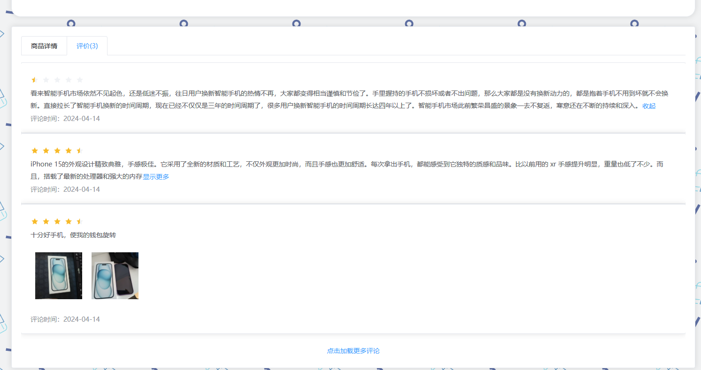
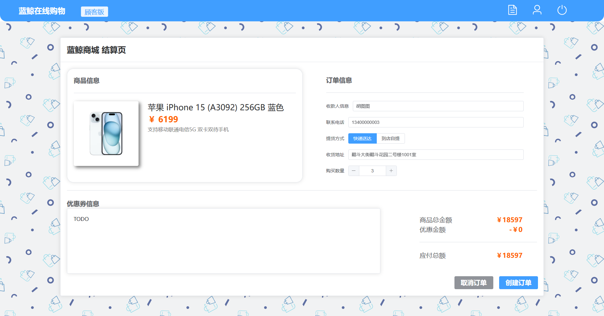
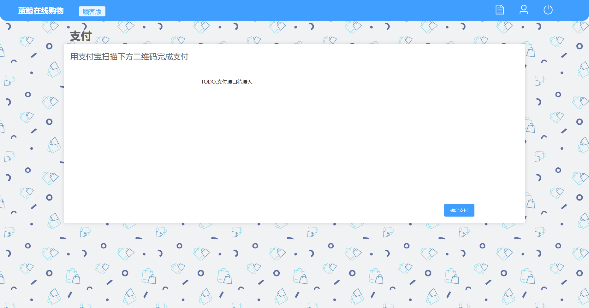
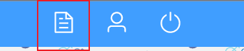
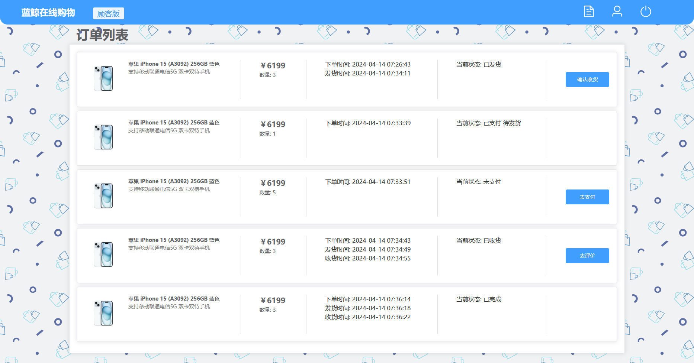
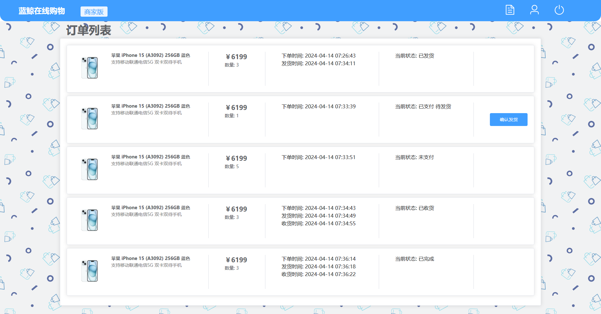
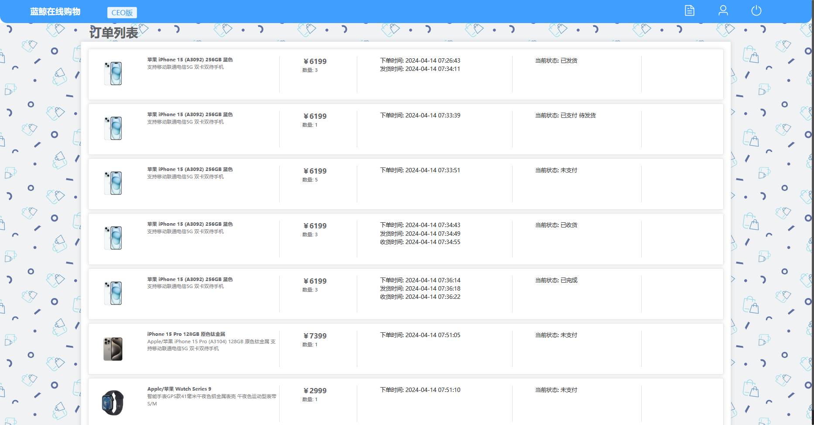
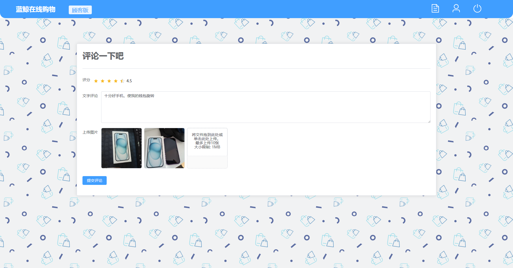

# 前端具体实现

## 商品详细页面

### 商品详情图

- 商品除了展示图之外，还可以有二级详情介绍图。
- 商品创建时可以上传详情介绍图


### 库存显示

- 商品拥有库存的显示
- 库存大于100时，显示为100+；库存小于100时，显示具体数字；库存为0时，显示为0，并且购买按钮变为无货按钮


- 使用v-if实现

```html
<el-row v-if="product.inventory > 100">剩余库存: 100+</el-row>
<el-row v-if="product.inventory <= 100">剩余库存: {{product.inventory}}</el-row>
<el-row class="price-text">￥{{product.price}}</el-row>
<el-button type="warning" v-if="product.inventory <= 0" :disabled=true  @click="handleToPurchase">暂时无货</el-button>
<el-button type="primary" v-if="product.inventory > 0" :disabled="role != 'CUSTOMER'" @click="handleToPurchase">立即购买</el-button>
```

### 购买权限

- **对应lab3文档的需求1**
- 只有顾客可以购买商品，其他Role在商品详细界面的购买按钮不可用

### 评论区

- **对应lab3文档的需求7**
- 商品的评论区也处于商品详细界面内。与商品详情介绍处于同一个标签页下，可以通过标签页头进行切换浏览。
- 众多评论采用懒加载，以应对评论数量巨大的情况。点击*加载更多评论*可以实现评论的加载
    - 加载到底时，按钮文字会变为*到底啦*并且不可继续点击
- 评论字数过多会进行折叠，可以点击*显示更多*来进行展开。展开之后也可以点击*收起*来关闭
- 评论的标签栏处会显示商品总评论个数（是总个数，不是当前懒加载了多少条），**对应lab3文档的需求6**



```tsx
function handleLoadComment(){
  reqCommentList({
    itemId: parseInt(productId.value),
    startInd: commentList.value.length
  }).then(res => {
    if(res.data.result.length == 0){
	    // 评论区到底了
      commentListEnd.value = true
    }
    else{
      commentList.value.push(...res.data.result)
    }
  })
}
```

```tsx
<el-tab-pane :label="'评价(' + commentCount + ')'">
  <el-container style="display: flex; flex-direction: column; align-items: center">
    <CommentItem style="width: 100%" v-for="item in commentList" :key="item.id" :comment-info="item"></CommentItem>
    <el-button style="margin-top: 20px" type="text" @click="handleLoadComment" v-if="!commentListEnd">点击加载更多评论</el-button>
    <el-text style="margin-top: 20px" v-if="commentListEnd">到底啦</el-text>
	</el-container>
</el-tab-pane>
```

## 创建订单页面

### 订单创建

- **对应lab文档需求1**
- 订单信息的表单会自动读取用户注册时的信息
- 顾客也可以临时更改信息
- 顾客可以选择提货方式为快递或自提
    - 选择自提时，收货地址一栏自动消失
- 购买数量最小为1，最大不超过库存数量
- 显示当前应付总额



```tsx
// 创建订单的请求方法
function createOrder() {
  reqOrderAdd({
    id: 0,
    itemId: productId.value,
    userId: userId.value,
    status: 'UNPAID',
    delivery: delivery.value,
    storeId: product.value.storeId,
    price: product.value.price,
    quantity: quantity.value
  }).then(res => {
    if (res.data.code === '000'){
      router.push({path: "/Payment/" + res.data.result})
    }
    else {
      ElMessage({
        message: "订单创建失败！",
        type: 'error',
        center: true
      })
    }
  }).catch(err => {
    ElMessage({
      message: "订单创建失败！",
      type: 'error',
      center: true
    })
  })
}
```

### 订单支付

- **对应lab文档需求2**
- 顾客点击*创建订单*之后，订单被创建，并且进入支付页面
- 点击*确定支付*可以立即下单
    - 如果不点，直接返回的话订单也会被保存，状态为未支付



```tsx
function payOrder() {
  reqOrderPay({
    orderId: parseInt(orderId.value)
  }).then(res => {
    if (res.data.code === '000') {
      ElMessage({
        message: '支付成功',
        type: 'success'
      })
      router.push('/orders')
    } else {
      ElMessage({
        message: '支付失败',
        type: 'error'
      })
    }
  })
}
```

## 订单页面

- 订单页面可以通过Header中的图标访问



```html
<el-col :span="1" class="header-icon">
  <router-link to="/orders" v-slot="{navigate}">
    <el-icon @click="navigate" :size="35" color="white" ><Document /></el-icon>
  </router-link>
</el-col>
```

### 顾客订单页面

- **对应lab文档需求3**
- 顾客能够访问自己的订单列表
- 订单列表包含一些必要的信息
- 针对不同状态的订单，用户可能会有相关操作，订单右端会出现操作的按钮
    - 操作包括确认收货，**对应lab文档需求5**



### 商店工作人员订单页面

- **对应lab文档需求3**
- 商店工作人员能访问自己商店的订单列表，其他商店是看不到的
- 看到的信息基本和顾客是一样的，只是操作的按钮不一样，商家只有一个确认发货的按钮
    - 点击确认发货后库存会进行修改



### 商场管理人员和经理订单页面

- 可以看到整个商场所有的订单
- 商场管理人员和经理无法对订单做任何操作



- 订单页面实现

```java
<script setup lang="ts">
import OrderItem from "../../components/OrderItem.vue";
import {reqAllOrder, reqOrderList, reqStoreOrderList} from "../../api/order.ts";
import {ref} from "vue";

const orderList = ref([])
const role = ref(sessionStorage.getItem('role'))

getOrders()

function getOrders(){
  // 根据用户角色获取订单列表
  if(role.value == 'CUSTOMER'){
    reqOrderList().then(res => {
      orderList.value = res.data.result
    })
  }
  if(role.value == 'STAFF'){
    reqStoreOrderList().then(res => {
      orderList.value = res.data.result
    })
  }
  if(role.value == 'CEO' || role.value == 'MANAGER'){
    reqAllOrder().then(res => {
      orderList.value = res.data.result
    })
  }
}
</script>

<template>
  <el-container style="display: flex; flex-direction: column; align-items: center" class="bgimage">
    <el-text style="width: 78%;text-align: left; font-size: 35px; font-weight: bold">订单列表</el-text>
    <el-card style="width: 80%">
      <OrderItem v-for="item in orderList" :key="item.createTime"  :order-info="item" :is-store-order=true></OrderItem>
    </el-card>
  </el-container>
</template>

<style scoped>
.bgimage {
  background-image: url("../../assets/shopping-1s-1084px.svg");
}
</style>
```

## 评论页面

### 新建评论

- **对应lab文档需求6**
- 顾客可以对已收货的订单进行评论
- 需要输入的信息包括：
    - 评分
    - 文字评论
    - 图片评论（可选）
- 评论后后端会自动计算评分，所以前端只需要上传评论就行啦



- 实现上和新建商品、新建商店类似