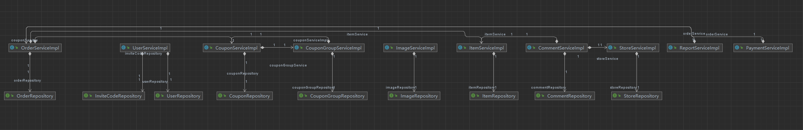
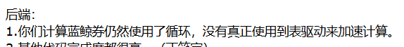
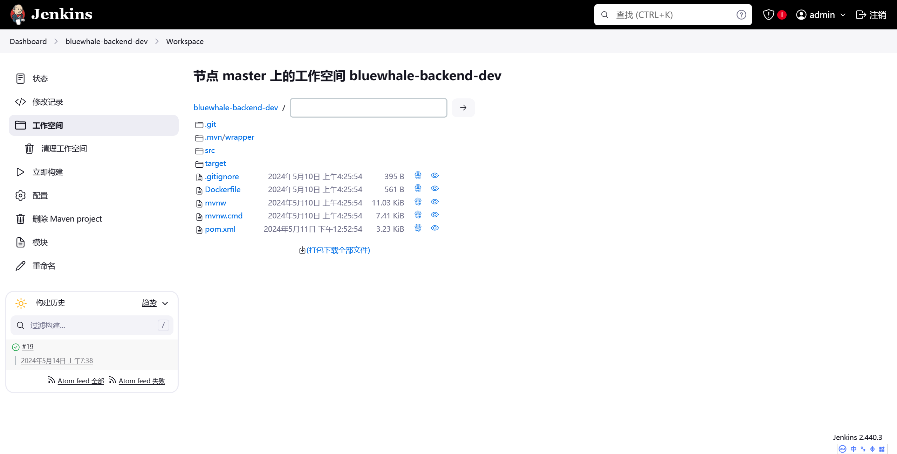
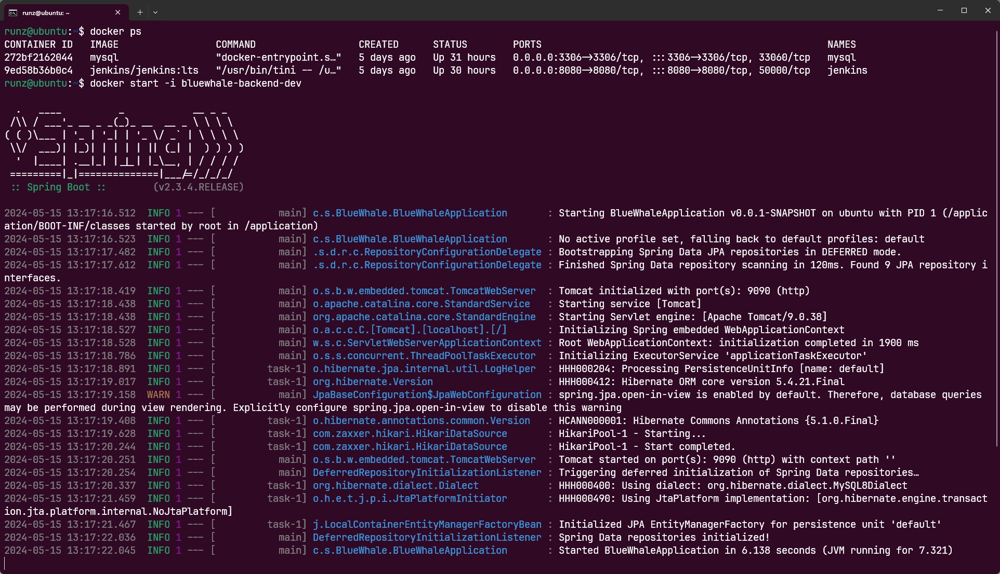

# 前端具体实现

## 组员信息

| 姓名   | 学号      | 电话        |
| ------ | --------- | ----------- |
| 刘存玺 | 221850148 | 17318601136 |
| 董天诺 | 221250004 | 13264512313 |
| 史创屹 | 221250106 | 15385019512 |
| 杨枫   | 221250155 | 18976304216 |

## 商品模块

> 1. 用户可以通过商品名称、品类、价格区间等条件查询商品。

- 将原来的所有商店页面加入了**商品广场**
- 通过卡片顶部的**标签栏**可以切换到所有商店的界面


- 商品列表采用**分页查询**，即在请求参数中包含要请求的页数，后端只返回对应页的商品列表。这里为了显示效果将页中商品数设置成了5。可以根据实际需求设置每页商品数。

    - 相较于之前的商店搜索，商品搜索的业务逻辑由后端实现，而不是前端。前端只需要发送含有搜索关键字的请求体就行。
    - 在底部可以切换当前页，底部页切换使用`el-pagination` 实现

    ```html
    <el-row class="centered-row">
      <el-pagination 
    	  layout="prev, pager, next" 
    	  :page-count="totPage" 
    	  v-model:current-page="page" 
    	  @click="handleSearchProduct"></el-pagination>
    </el-row>
    ```

- 在商品广场卡片顶部，可以通过商品名称**搜索**商品。支持**模糊搜索**

    - 搜索栏输入框可以**一键清除**输入内容

        

- 点击高级可以进行**高级查询**，包括筛选商品**品类**、筛选**价格区间**、调整结果**顺序**

    - 可以只输入部分筛选条件，比如只设置价格区间下限

        

    - 可以设置多个分类，搜索结果将返回已选分类的所有商品

    - 前端显示的分类是枚举类的英文名称，这不是用户友好的。前端同学将~~鞭策~~后端同学在下次Lab中修复这个问题

        

        多选选择器由`el-select` 的`multiple` 属性实现，并通过设置`collapse-tags` ，使过多的选项折叠成”+n”的形式（如上图的+1），简化界面。
    
        ```html
        <el-select 
        	style="width: 200px" 
        	multiple 
        	collapse-tags 
        	v-model="kwdProductCategory" 
        	placeholder="所有">
          <el-option 
        	  v-for="category in categoryEnum" 
        	  :key="category" 
        	  :label="category" 
        	  :value="category"></el-option>
        </el-select>
        ```

## 接入支付

> 2. 用户支付时可以使用支付宝沙箱进行支付。

- 用户选择支付订单后，将跳转至**支付中间页**

    - 可以在此页**扩展**更多的支付方式，如微信支付等。现在选择支付宝之外的支付方式会有未开通的提示。

    

- 点击跳转后，前端弹出**新的标签页**，以显示支付宝的支付页面


```tsx
// 打开一个空白页
const payTab = window.open()
if(!payTab) {
  ElMessage({
    message: '请允许弹出窗口',
    type: 'warning'
  })
  return
}
// 将支付宝的页面写到创建的页面中
payTab.document.write(alipayForm.value)
```

- 此时支付页会向后端**轮询**订单**支付状态**。用户扫码支付后，后端将处理相关业务，并改变订单状态。此时前端轮询到订单已支付，会自动关闭支付宝页面，并跳转到订单页面。

    ```tsx
    let polling = () => {
    	reqOrder({
    	  orderId: parseInt(orderId.value)
    	}).then(res => {
    	  if (res.data.code === '000') {
    		  // 检测订单状态
    	    if(res.data.result.status === 'UNPAID') {
    	      // 一秒轮询一次
    	      setTimeout(() => { polling() }, 1000)
    	    } else {
    	      // 关闭支付窗口
    	      payTab.close()
    	      // 跳转至订单列表页
    	      router.push({path: '/orders'})
    	    }
    	  } else {
    	    // 网络错误
    	    ElMessage({
    	      message: res.data.message,
    	      type: 'error'
    	    })
    	  }
    	})
    }
    ```

    - 有关这一部分的处理，有一个关键的**问题**：按我们的理解，支付宝回调函数调用的是后端的接口，那这样前端怎么得到支付成功的notify呢？
        - 用轮询可以解决问题([出处](https://www.cnblogs.com/kenshinobiy/p/8882722.html))。但是轮询有相当大的缺点，比如会占后端很大的带宽甚至爆破后端。

## 下载报表

> 3. 经理（CEO）可以下载所有订单的报表。门店工作人员可以下载本门店的报表。报表内容包括交易人员、交易时间、交易内容等，以Excel形式呈现。

- 在用户的个人界面中可以看到**下载订单报表**的按钮
    - 只有商家和CEO能看到这个按钮，其他身份是看不到的


- 点击后浏览器会下载商家所在商店或者全局的订单报表


- 打开返回的文件Url即可实现下载

```tsx
function downloadReport() {
  reqReportUrl({storeId: storeId.value}).then(res => {
    window.open(res.data.result)
  })
}
```

# 后端具体实现

## 基本功能模块

### 支付模块

#### 请求支付

- 创建支付请求并通过支付宝的client调用支付宝后端，得到支付页的表单html并返回给前端
- **实现细节**
    - 创建支付宝client，并设置request相关参数
    - 发送request，接受支付页表单的html并发送给前端

```java
public void pay(AliPay aliPay, HttpServletResponse httpResponse) throws Exception {
        // 创建client
        AlipayClient client = new DefaultAlipayClient(serverUrl, appId, privateKey, FORMAT, charset, alipayPublicKey, signType);
        // 创建request并设置参数
        AlipayTradePagePayRequest request = new AlipayTradePagePayRequest();
        request.setNotifyUrl(notifyUrl);
        request.setReturnUrl(returnUrl);
        JSONObject bizContent = new JSONObject();
        bizContent.put("out_trade_no", aliPay.getTraceNo());
        bizContent.put("total_amount", aliPay.getTotalAmount());
        bizContent.put("subject", aliPay.getSubject());
        bizContent.put("product_code", "FAST_INSTANT_TRADE_PAY");
        request.setBizContent(bizContent.toString());

        // 执行请求
        String form = "";
        try {
            form = client.pageExecute(request).getBody();
        } catch (Exception e) {
            e.printStackTrace();
        }
        httpResponse.setContentType("text/html;charset=" + charset);
        httpResponse.getWriter().write(form);// 直接将完整的表单html输出到页面
        httpResponse.getWriter().flush();
        httpResponse.getWriter().close();
    }
```

#### 回调接口

- 支付宝后端在处理好订单之后会调用这个接口。调用后，后端会将本地数据库中的订单状态变更为已支付
- **实现细节**
    - 先拿到相关参数，然后验签，保证数据传输无误
    - 将更新订单状态的逻辑交给订单模块做，而不是直接使用订单的Repository层，实现了模块间的解耦

```java
public String notify(HttpServletRequest request) throws Exception {
    if (request.getParameter("trade_status").equals("TRADE_SUCCESS")) {
        System.out.println("=========支付宝异步回调========");
        Map<String, String> params = new HashMap<>();
        Map<String, String[]> requestParams = request.getParameterMap();
        for (String name : requestParams.keySet()) {
            params.put(name, request.getParameter(name));
            System.out.println(name + " = " + request.getParameter(name));
        }

        String sign = params.get("sign");
        String content = AlipaySignature.getSignCheckContentV1(params);
        boolean checkSignature = AlipaySignature.rsa256CheckContent(content, sign, alipayPublicKey, "UTF-8"); // 验证签名
        // 支付宝验签
        if (checkSignature) {
            int orderId = Integer.parseInt(params.get("out_trade_no"));
            // 支付成功后调用订单模块的业务逻辑，修改订单状态
            orderService.purchaseOrder(orderId);
            // 测试输出
            if(debug){...}
            return "success";
        }
    }
    return "fail";
}
```

#### 退出函数

- 支付页的任务完成后会调用此接口。这个接口会返回提示字符串，提醒用户关闭支付页面
- 自动关闭支付页的逻辑由前端实现，这个接口只是防止异常情况下支付页没有自动关闭

```java
public String returnUrl() {
    return "支付成功！如果页面没有自动关闭，请手动关闭页面！";
}
```

### 商品模块

#### 搜索商品

- 根据提供的搜索信息，返回筛选后的商品列表的对应页。
- **实现细节**
    - 使用**Specification**和**Pageable**实现JPA**条件筛选**以及**分页**
    - 获取当前所需页码
    - 处理搜索内容，将其载入Predicate List中作为查询条件
        - 处理搜索名称，并实现**模糊搜索**
        - 处理最高、最低价格区间
        - 处理搜索分类，由于支持**多分类**的搜索，所以要注意多个分类之间的条件
        - 处理价格排序需求

```java
// src/serviceImpl/itemServiceImpl.java
@Override
public Page<Item> getItemByConditions(Map<String, Object> params){
    // 每一页的商品数量，设置为5方便展示
    int pageSize = 5;
    Pageable pageable = PageRequest.of((int) params.get("page") - 1, pageSize);
    return itemRepository.findAll(itemSpecification.whereItem(params), pageable);
}
```

```java
// src/serviceImpl/specification/itemSpecification.java
public static Specification<Item> whereItem(Map<String, Object> params) {
    // 通过匿名内部类实现Specification接口
    // 参考: https://blog.csdn.net/weixin_46005530/article/details/132626158
    return (Root<Item> root, CriteriaQuery<?> query, CriteriaBuilder cb) -> {
        List<Predicate> predicates = new ArrayList<>();

        // 处理name参数
        String name = (String) params.get("name");
        if (name != null) {
            // 模糊查询的实现: cb.like
            predicates.add(cb.like(root.get("name"), "%" + name + "%"));
        }
        // 处理price参数
        Integer minPrice = (Integer) params.get("minPrice");
        if(minPrice != null){
            predicates.add(cb.ge(root.get("price"), minPrice));
        }
        Integer maxPrice = (Integer) params.get("maxPrice");
        if(maxPrice != null){
            predicates.add(cb.le(root.get("price"), maxPrice));
        }
        // 处理category参数表
        List<Predicate> categoryPredicates = new ArrayList<>();
        Object categoryList = params.get("category");
        List<String> categories = null;
        if(categoryList instanceof ArrayList<?>){
            categories = (List<String>) categoryList;
        }
        if(categories != null){
            for(String category : categories){
                categoryPredicates.add(cb.equal(root.get("category"), CategoryEnum.valueOf(category)));
            }
            // 处理多个category的情况
            predicates.add(cb.or(categoryPredicates.toArray(new Predicate[0])));
        }
        // 处理排序参数
        String priceOrder = (String) params.get("priceOrder");
        if(priceOrder != null){
            if(priceOrder.equals("asc")){
                query.orderBy(cb.asc(root.get("price")));
            }else if(priceOrder.equals("desc")){
                query.orderBy(cb.desc(root.get("price")));
            }
        }
        // 返回封装好的查询条件
        return query.where(predicates.toArray(new Predicate[0])).getRestriction();
    };
}    

```

### 报表模块

- 使用Apache POI创建报表，并上传到OSS，向前端返回文件的url

```java
private String createReport(int storeId){
    List<OrderVO> orders = orderService.queryOrder(storeId);
    // 表头
    List<String> head = new ArrayList<>();
    head.add("订单号");
    head.add("交易时间");
    head.add("商品号");
    head.add("买家ID");
    head.add("商店ID");
    head.add("订单金额");
    // 创建excel报表
    XSSFWorkbook workbook = new XSSFWorkbook();
    XSSFSheet sheet = workbook.createSheet();
    sheet.createFreezePane(0, 1, 0, 1); // 冻结第一行
    sheet.setDefaultRowHeight((short) (2 * 256)); // 设置行高
    for (int i = 0; i < head.size(); i++) {
        sheet.setColumnWidth(i, 4000);
    }
    sheet.setColumnWidth(1, 8000);
    XSSFRow row1 = sheet.createRow(0);
    for (int i = 0; i < head.size(); i++) {
        row1.createCell(i).setCellValue(head.get(i));
    }
    XSSFCellStyle csDate = workbook.createCellStyle();
    XSSFCellStyle csPrice = workbook.createCellStyle();
    csDate.setDataFormat(workbook.createDataFormat().getFormat("yyyy-MM-dd HH:mm:ss"));
    csPrice.setDataFormat(workbook.createDataFormat().getFormat("0.00"));
    for (int i = 0; i < orders.size(); i++) {
        XSSFRow row = sheet.createRow(i + 1);
        OrderVO order = orders.get(i);
        row.createCell(0).setCellValue(order.getId());
        XSSFCell cellDate = row.createCell(1);
        cellDate.setCellValue(order.getCreateTime());
        cellDate.setCellStyle(csDate);
        row.createCell(2).setCellValue(order.getItemId());
        row.createCell(3).setCellValue(order.getUserId());
        row.createCell(4).setCellValue(order.getStoreId());
        XSSFCell cellPrice = row.createCell(5);
        cellPrice.setCellValue(order.getPrice());
        cellPrice.setCellStyle(csPrice);
    }
    // 上传到oss
    String name = "report" + storeId + ".xlsx";
    String url = "";
    try {
        ByteArrayOutputStream out = new ByteArrayOutputStream();
        workbook.write(out);
        out.close();
        InputStream is = new ByteArrayInputStream(out.toByteArray());
        workbook.close();
        url = ossUtil.upload(name, is);
    }catch (Exception e){
        e.printStackTrace();
        throw UserException.fileUploadFail();
    }
    return url;
}
```

### 测试模块

#### 商品搜索模块

使用本地数据库进行测试，并采取人工校验的方式对测试结果进行检验。

- 测试代码模板

```java
 	  @Autowired
    ItemService itemService;
    @Autowired
    ItemRepository itemRepository;

    @Test
    void getItemByConditionsTest() {
        Map<String,Object> params = new HashMap<>();
        params.put("name",itemName);
        params.put("minPrice",minPrice);
        params.put("maxPrice",maxPrice);
        params.put("page",pageNumber);
        params.put("category",CategoryEnum);
        params.put("priceOrder","desc"/"acs");
        
        Page<Item> res = itemService.getItemByConditions(params);
        return;
    }
```

## 优化

### 重构ServiceImpl层和Repository层的依赖

我们重构了ServiceImpl层和Repository层的依赖，使得Repository只被其对应的ServiceImpl层所调用，而对其他Repository的调用则通过serviceImpl层之间的依赖实现。这样进一步降低了各模块间的耦合。



### 修复类型问题

有一些接口向前端返回了PO类型，而没有转换成VO。这次的Lab修复了这个问题。

使用了**Stream API**将PO的列表转换成了VO列表，以下为一个例子：

```java
public List<ItemVO> getItemListByStoreId(Integer storeId) {
    List<Item> poList = itemRepository.findByStoreId(storeId);
    return poList.stream().map(Item::toVO).collect(Collectors.toList());
}
```

### 优惠券模块

#### 计算价格（修复表驱动）



应助教gg的回复，修改了蓝鲸券计算策略中循环阶梯访问表。注意到蓝鲸券的阶梯折扣规则是整百为一个阶梯，所以可以直接通过**整除**得到驱动表的索引。

这样取巧的方法似乎只能适用于比较规则的阶梯表，如果是不规则的阶梯似乎就无法避免循环扫描驱动表了

```java
@Service
public class ClaculateSpecial implements CouponStrategy{
    // 表驱动 Revisited
    float[] driver_ = {0.95f,0.9f,0.85f,0.8f,0.75f,0.7f};
    @Override
    public float calculate(Coupon coupon, float price) {
		    // 整除得到索引
        int i = (int) Math.floor (price / 100);
        if (i >= driver_.length - 1)
            i = driver_.length-1;
        float discount = driver_[i];
        return price*discount;
    }
}
```

所以，我们还是决定先使用**原来**的有循环的表驱动。并且想问一下**阶梯访问**的表驱动如何**不用循环**实现？

```java
@Service
public class ClaculateSpecial implements CouponStrategy{
    // 表驱动 Original
    float[][] driver = {
            {100, 0.95f},
            {200, 0.9f},
            {300, 0.85f},
            {400, 0.8f},
            {500, 0.75f},
            {Float.POSITIVE_INFINITY, 0.7f}
    };
    @Override
    public float calculate(Coupon coupon, float price) {
        for (float[] floats : driver) {
            if (price < floats[0]) {
                return price * floats[1];
            }
        }
        return price;
    }
}
```


## 其他

### 部署到ECS

由于此次Lab中存在内网穿透相关的需求，我们索性直接将后端部署到了**云服务器**上，支付宝通过服务器的公网IP可以直接调用回调接口。

这样也便于小组成员的协同开发与测试，后端同学写了新模块可以立即部署到Dev实例上，前端同学可以立即使用新的接口。

- 使用**Jenkins**实现项目的**持续集成**和**部署**，通过Git仓库的**WebHook**实现git push后重新构建与部署



- 项目实例以及数据库部署在**Docker**上，便于创建与释放（虽然Jenkins会自动做这些工作）

